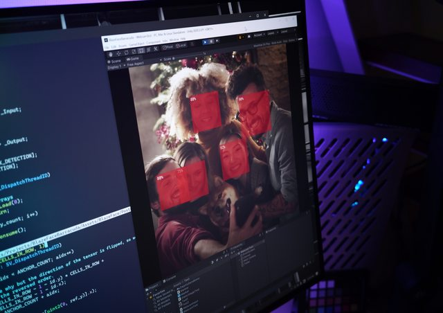

# Barracuda Starter Kit

This is a [Barracuda](https://github.com/Unity-Technologies/barracuda-release) demo library containing usage examples. All examples are also compatible with mobile platforms (iOS and Android).

Each example is placed in a separate folder with a demo scene and all the required resources.

## Static Image Recognition


MobileNetV2 [pytorch.org](https://pytorch.org/hub/pytorch_vision_mobilenet_v2) example running in Barracuda on a set of static images. 

To use this demo, open and run the `01-StaticImageRecognition-MobileNetV2` scene. Select the image and the top matching class will be selected for it, outputting the class name and accuracy percentage. 

This model was converted to `onnx` file using Python and `torch.onnx` from the `pytorch_vision_mobilenet_v2.ipynb` Google Colab. Softmax layer was added to the output layer to normalize resulting accuracy values. The following script was added to the PyTorch MobileNet demo source code.
```Python
import torch
import torch.onnx
#...
#...
model = torch.nn.Sequential(model, torch.nn.Softmax(1))
torch_onnx.export(model, input_batch, "mobilenet_v2.onnx", verbose=False)
```

This model has 1000 classes and should be used with a square `224x224` image. Demo project preprocesses the image to fit the target image dimensions, but the best accuracy is reached when the height and width ratio equals one. 

Images used for this demo are created by Aurimas Petrovas and are under Unity license.

## Face Tracking 



[MediaPipe BlazeFace](https://sites.google.com/view/perception-cv4arvr/blazeface) model. Simplified real time camera face tracking Barracuda demo [project](https://github.com/keijiro/BlazeFaceBarracuda) originally created by Keijiro Takahashi.

To use this demo, open and run the `02-FaceTracking-BlazeFace` scene. Point the web camera at a face and it will add a bounding box around the face with accuracy percentage and facial feature points. 

The BlazeFace ONNX model was originally converted by PINTO0309 (Katsuya Hyodo).
Please refer to [his model zoo](https://github.com/PINTO0309/PINTO_model_zoo) for more information. Keijiro Takahashi converted his ONNX model into a Barracuda-compatible form. Please
check [this Colab notebook]( https://colab.research.google.com/drive/1O1KDIVsmYyYDqEqv7hEqofsHMCa49xaZ?usp=sharing) for the details of the conversion process.
