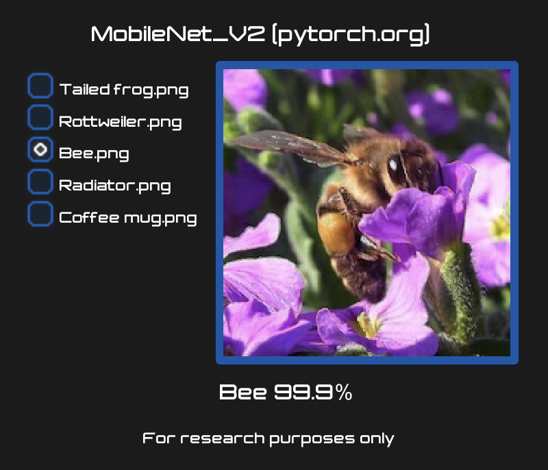

# Barracuda Starter Kit

This is a [Barracuda](https://github.com/Unity-Technologies/barracuda-release) demo library containing usage examples. All examples are also compatible with mobile platforms (iOS and Android). WebGL supports only the Static Image Recognition example.  

## Static Image Recognition

MobileNetV2 [pytorch.org](https://pytorch.org/hub/pytorch_vision_mobilenet_v2) example running in Barracuda on a set of static images. 

## Face Tracking 

[MediaPipe BlazeFace](https://sites.google.com/view/perception-cv4arvr/blazeface) model. Simplified real time camera face tracking Barracuda demo [project](https://github.com/keijiro/BlazeFaceBarracuda) originally created by Keijiro Takahashi.
